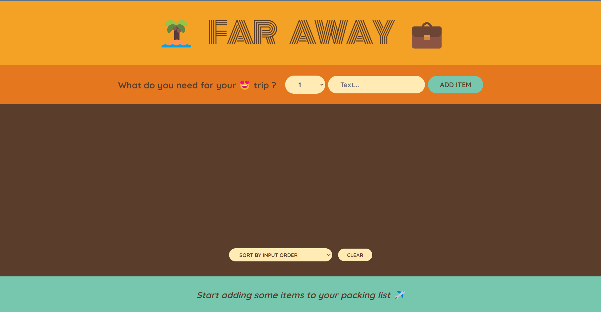

# Travel List React App

This is an interesting a very useful app, which helps you alot in preparing your packing list bvefore going on a trip.

## Features

- It contains functionalities like components, props, state and fragments.
- It demostrates how we can share properties between components.
- You can add/edit/remove/order items as per your choices.

## How to run the project

- Download or clone the repository
- Do a `npm install` to install necessary packages
- Then run `npm run start`
- Then the project should locally at port 3000.

## After Running it should look like below image

